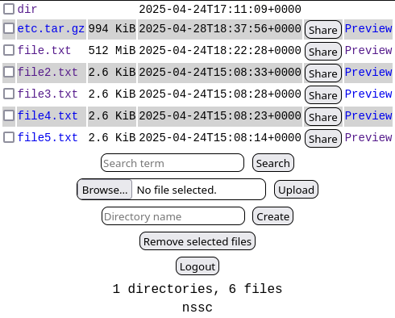

[](https://opensource.org/licenses/MIT)

# nssc

nssc (not so simple cloud) - lightweight self-hosted cloud storage solution with multiple file protocols.



Heavily inspired by the [slcl](https://codeberg.org/xavidcr/slcl) project

## Features

- Private access directory with file uploading, with configurable quota.
- Public read-only file sharing.
- A simple JSON file as the credentials database.
- No JavaScript.

### Supported protocols

- `Web-based` (same as `slcl`)
- `REST API`
- `WebDAV`
- `9P/Styx` (on the way)

### Security

- Strict path validation
- Quota enforcement

### TLS

In order to maintain simplicity and reduce the risk for security bugs, `nssc` does not implement TLS support.
Instead, this should be provided by a reverse proxy, such as `nginx`, `caddy`, etc.

## Getting Started

### Prerequisites

- Go 1.24+
- POSIX-compliant OS (Linux/macOS)

### Build

```sh
git clone https://github.com/nikita-popov/nssc.git
cd nssc
make
```

#### Tests

```sh
make check
```

### Setting up

`nssc` consumes a path to a directory with the following tree structure:

```
.
├── db.json
├── public
└── user
```

Where:

- `db.json` is the credentials database. Details are explained below.
  - **Note:** `nssc` creates a database with no users if not found, with file mode bits set to 0600.
- `public` is a directory containing read-only files that can be accessed without authentication. Internally, they are implemented as simlinks to other files.
  - **Note:** `nssc` creates this directory if it does not exist, with directory mode bits set to 0700.
- `user` is a directory containing user directories, which in turn contain anything users put into them.
  - **Note:** `nssc` creates this directory if it does not exist, with directory mode bits set to 0700.

**Note:** `nssc` creates the given directory if it does not exist.

A more complete example:

```
.
├── db.json
├── public
│   └── 01966845-72bb-7902-85b3-a44a0112d351 -> user/alice/file.txt
└── user
    ├── alice
    │   └── file.txt
    └── john
        └── file2.txt
```

### Credentials database

`nssc` reads credentials from the `db.json` database, with the following schema:

```json
{
    "users": [{
        "name": "...",
        "password": "...",
        "salt": "...",
        "key": "...",
        "quota": "..."
    }]
}
```

- `name` - user name, will be userd in authentication and directory path.
- `password` - `bcrypt` hashed password+salt.
- `salt` - randomly generated data.
- `key` - randomly generated that is later used to sign HTTP cookies.
- `quota` - user storage quota in MiB, GiB, etc.

`nssc adduser` is an command that consumes positional args:

- base directory
- username
- user quota in MiB (optionally

Example:

```sh
nssc adduser ~/storage/ alice 10GiB
nssc adduser ~/storage/ bob 512MiB
```

After executing the `adduser` command, you will be prompted to enter the password and confirm it interactively.

Then, `adduser` appends a JSON object to the users JSON array in the `db.json` file located inside the given directory.
Also, `adduser` creates the user directory inside the `user/` directory.

When users authenticate from a web browser, `nssc` sends a SHA256HMAC-signed JSON Web Token, using the random key generated by `adduser`.
No session data is kept on the server.

### Running

To run `nssc`, simply run the executable with the path to a directory including the files listed above.
By default, `nssc` will listen to incoming connections on a random TCP port number.
To set a specific port number, use the -p command line option. For example:

```sh
nssc run :8080 ~/storage/
```

## Protocols

### Public Sharing

Shared files are accessible via: `http://{domain}/public/{uuidv7}`

### REST API

#### Endpoints

| Method | Path                      | Description                     |
|--------|------------------------|-------------------------------|
| GET    | /api/{user}/{path}       | List directory/download file  |
| PUT    | /api/{user}/{path}       | Upload file                     |
| POST   | /api/{user}/{path}/      | Create directory               |
| DELETE | /api/{user}/{path}       | Delete file/directory         |
| POST   | /api/{user}/{path}/share | Generate share link           |

#### Example Usage

```sh
# List files
curl -u user:pass http://localhost:8080/api/user/documents

# Upload file
curl -X PUT -u user:pass -T file.txt http://localhost:8080/api/user/documents/file.txt

# Create directory
curl -X POST -u user:pass http://localhost:8080/api/user?mkdir=archive

# Generate share link
curl -X POST -u user:pass http://localhost:8080/api/user/documents/file.txt/share
# Response: {"link":"/public/018f1d24-7b7f-7f3d-ae2d-c1d079e3c992"}
```

### WebDAV

Connect using any WebDAV client:

```sh
# Connection URL
http://localhost:8080/webdav/{username}

# Example with rclone
rclone mount :webdav: /mnt/nssc \
  --webdav-url http://localhost:8080 \
  --webdav-user user \
  --webdav-pass pass
```

### 9P (Styx)

Will be later.

## Bugs

Probably

## Why this project?

If you need:

- more protocols support
- heterogeneous systems support

`nssc` is perfect for you.

If you need only web-based cloud - it's better to use `slcl`.

## License

MIT License - see [LICENSE](LICENSE) for details.
