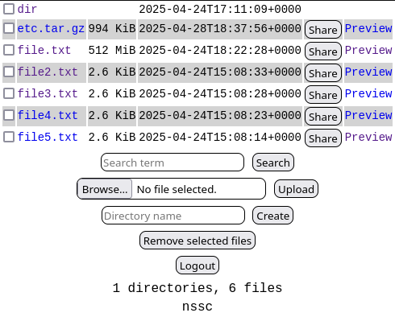

[](https://opensource.org/licenses/MIT)

# nssc

nssc (not so simple cloud) — lightweight self-hosted cloud storage with multiple file access protocols.



Heavily inspired by the [slcl](https://codeberg.org/xavidcr/slcl) project.

## Features

- Private per-user directories with file uploading and configurable quota.
- Public read-only file sharing via UUIDv7 links.
- Simple JSON credentials database — no external services required.
- No JavaScript in the web UI.

### Supported protocols

| Protocol | Status |
|---|---|
| Web UI | ✅ |
| REST API | ✅ |
| WebDAV | ✅ |
| 9P2000 (Styx) | ✅ |

### Security

- Strict path validation (no directory traversal)
- Per-user quota enforcement on all protocols
- JWT-based web session authentication

### TLS

`nssc` does not implement TLS directly. Use a reverse proxy such as `nginx` or `caddy`.

## Getting Started

### Prerequisites

- Go 1.24+
- POSIX-compliant OS (Linux/macOS)

### Build

```sh
git clone https://github.com/nikita-popov/nssc.git
cd nssc
make
```

#### Tests

```sh
make check
```

### Storage directory layout

`nssc` uses a single root directory with the following structure:

```
.
├── db.json
├── public
└── user
```

- `db.json` — credentials database (created with mode 0600 if absent).
- `public` — read-only files accessible without authentication, implemented as symlinks.
- `user` — per-user directories.

`nssc` creates the root directory and all subdirectories if they do not exist.

Full example:

```
.
├── db.json
├── public
│   └── 01966845-72bb-7902-85b3-a44a0112d351 -> user/alice/file.txt
└── user
    ├── alice
    │   └── file.txt
    └── john
        └── file2.txt
```

### Credentials database

`db.json` schema:

```json
{
    "users": [{
        "name": "alice",
        "password": "<bcrypt hash>",
        "key": "<random JWT signing key>",
        "quota": "10GiB"
    }]
}
```

- `name` — username used for authentication and directory path.
- `password` — bcrypt hash of the password.
- `key` — random key used to sign JWT cookies for the web UI.
- `quota` — storage quota (e.g. `512MiB`, `10GiB`).

### Adding users

```sh
nssc adduser ~/storage/ alice 10GiB
nssc adduser ~/storage/ bob 512MiB
```

You will be prompted to enter and confirm the password interactively. `adduser` appends the user to `db.json` and creates `user/<username>/`.

### Running

```sh
# HTTP on a specific port
nssc run -p :8080 ~/storage/

# HTTP + 9P on standard port
nssc run -p :8080 -9p :564 ~/storage/

# HTTP + 9P over Unix socket
nssc run -p :8080 -9p unix:///run/nssc.sock ~/storage/
```

By default `nssc` picks a random port. Use `-p` to bind to a specific address.

## Protocols

### Public Sharing

Shared files are accessible at:

```
http://{domain}/public/{uuidv7}
```

### Web UI

Browser-based file manager (no JavaScript required).

`style.css` is created in the storage root at startup if it does not already exist — customise freely.

If `favicon.ico` exists in the storage root it will be served automatically.

### REST API

#### Endpoints

| Method | Path | Description |
|--------|------|--------------|
| GET | `/api/{user}/{path}` | List directory / download file |
| PUT | `/api/{user}/{path}` | Upload file |
| POST | `/api/{user}/{path}/` | Create directory |
| DELETE | `/api/{user}/{path}` | Delete file or directory |
| POST | `/api/{user}/{path}/share` | Generate share link |

#### Examples

```sh
# List files
curl -u user:pass http://localhost:8080/api/user/documents

# Upload file
curl -X PUT -u user:pass -T file.txt http://localhost:8080/api/user/documents/file.txt

# Create directory
curl -X POST -u user:pass http://localhost:8080/api/user/documents/

# Generate share link
curl -X POST -u user:pass http://localhost:8080/api/user/documents/file.txt/share
# Response: {"link":"/public/018f1d24-7b7f-7f3d-ae2d-c1d079e3c992"}
```

### WebDAV

```sh
# Connection URL pattern
http://localhost:8080/webdav/{username}

# Mount with rclone
rclone mount :webdav: /mnt/nssc \
  --webdav-url http://localhost:8080/webdav/alice \
  --webdav-user alice \
  --webdav-pass pass

# Mount with davfs2 (Linux)
mount -t davfs http://localhost:8080/webdav/alice /mnt/nssc
```

### 9P

9P2000 support allows mounting the user storage directly in the filesystem namespace. Start the server with `-9p`:

```sh
nssc run -p :8080 -9p :564 ~/storage/
```

#### Mounting on Linux (v9fs)

```sh
# TCP
mount -t 9p -o trans=tcp,port=564,uname=alice,aname=alice,version=9p2000 \
  localhost /mnt/nssc

# Unix socket (requires -9p unix:///run/nssc.sock)
mount -t 9p -o trans=unix,uname=alice,aname=alice,version=9p2000 \
  /run/nssc.sock /mnt/nssc
```

#### Mounting on Plan 9 / 9front

```sh
authsrv=none
mount -a tcp!localhost!564 /mnt/nssc
```

#### Accessing with plan9port (macOS / Linux)

```sh
9 mount tcp!localhost!564 /mnt/nssc
```

#### Authentication

The 9P server uses the styx `AuthFunc` mechanism. Pass the username as `uname` and the password as the `aname` field, or configure your 9P client's factotum accordingly.

#### Quota

Write operations (file creation, open-for-write) are subject to the same per-user quota as the REST API and WebDAV interfaces. Writes that would exceed the quota are rejected with `EPERM`.

## Bugs

Probably.

## Why this project?

If you need:

- Multiple protocol access (web, REST, WebDAV, 9P)
- Heterogeneous client support (Linux, Plan 9, macOS)
- Simple, auditable self-hosted storage

`nssc` is a good fit. If you only need a web UI, [slcl](https://codeberg.org/xavidcr/slcl) is simpler.

## License

MIT License — see [LICENSE](LICENSE) for details.
